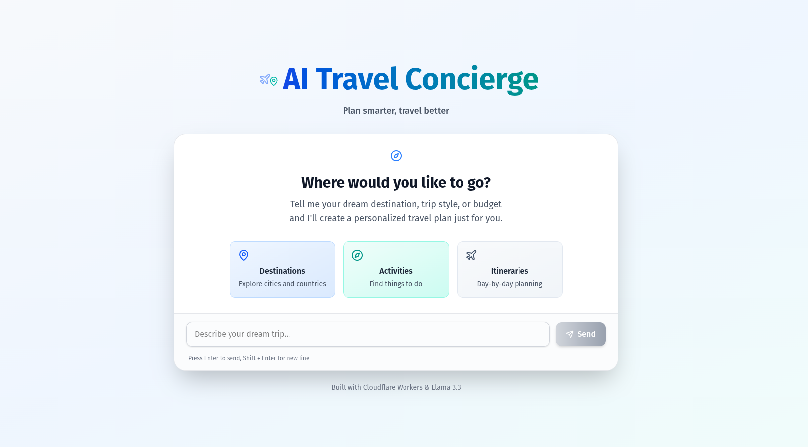

# AI Travel Agent




Serverless AI travel planner built with Cloudflare Workers, Durable Objects, and Llama 3.3 70B. Generate personalized itineraries with persistent user memory.

### Running site is available at:
> https://ai-travel-agent-2gy.pages.dev/


## Features

- 🤖 AI-powered itineraries using Llama 3.3 70B
- 💾 User memory with Durable Objects
- ⚡ Serverless on Cloudflare's edge network
- 🔄 Structured JSON outputs

## Quick Start

```bash
# Install
npm install

# Configure wrangler.toml with your settings

# Login
npx wrangler login

# Run server
npx wrangler dev

# Run locally
npm run dev
```

## API

### POST `/api/generate`

Generate a travel plan.

```json
{
  "userId": "user123",
  "message": "I want to visit Japan for 2 weeks in spring with a $3000 budget"
}
```

Returns itinerary, daily schedule, and packing list.

### GET `/api/profile/:userId`

Get user's saved profile and preferences.

## Configuration

Create `wrangler.toml`:

```toml
name = "ai-travel-guide"
main = "src/index.ts"
compatibility_date = "2024-01-01"

[ai]
binding = "AI"

[[durable_objects.bindings]]
name = "USER_MEMORY"
class_name = "UserMemory"
script_name = "ai-travel-guide"

[[migrations]]
tag = "v1"
new_classes = ["UserMemory"]
```

## Project Structure

```
src/
├── index.ts           # Main worker
├── workflow.ts        # AI orchestration
├── ai.ts             # Llama wrapper
├── memory/
│   ├── UserMemory.ts # Durable Object
│   └── schema.ts     # Types
└── utils/
    ├── helpers.ts    # CORS, responses
    └── prompts.ts    # AI prompts
```

## How It Works

1. Client sends travel request
2. Load user profile from Durable Object
3. AI generates itinerary, schedule, and packing list in one call
4. Update user profile with new preferences
5. Return structured JSON response


## Development

### Local Testing

```bash
# Start dev server
npx wrangler dev

# Test with curl
curl -X POST http://localhost:8787/api/generate \
  -H "Content-Type: application/json" \
  -d '{
    "userId": "test-user",
    "message": "Plan a week in Paris for $2000"
  }'
```

### Customization

**Modify AI behavior**: Edit prompts in `src/utils/prompts.ts`

**Add endpoints**: Add route handlers in `src/index.ts`

**Change memory schema**: Update `src/memory/schema.ts`

## Troubleshooting

**Durable Object not found**: Run `wrangler migrations apply`

**AI binding not available**: Enable Workers AI in your Cloudflare account

**CORS errors**: Worker automatically handles preflight requests

**Slow responses**: Adjust `max_tokens` in `ai.ts` or simplify prompts


## Tech Stack

- Cloudflare Workers
- Llama 3.3 70B (Workers AI)
- Durable Objects
- TypeScript

## License

MIT