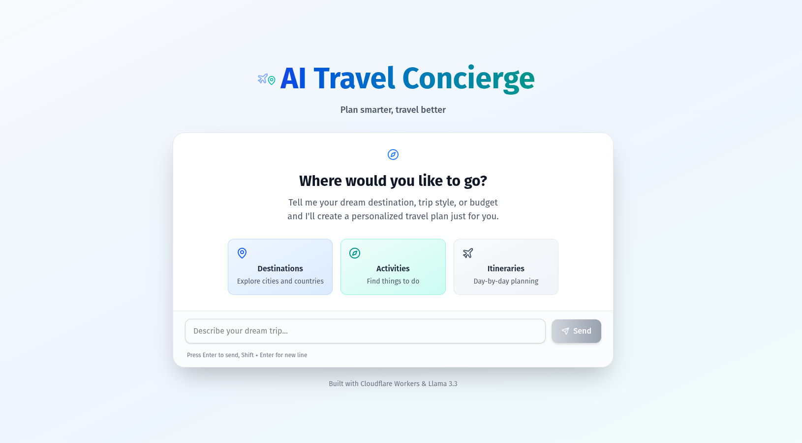

# AI Travel Agent



Serverless AI travel planner built with Cloudflare Workers, Durable Objects, and Llama 3.3 70B.
Generate personalized itineraries with persistent user memory.

### Running site is available at:
> https://travel-agent-111.pages.dev/

## Features

- 🤖 AI-powered day-by-day itineraries using Llama 3.3 70B
- 🖼️ Destination photos from Unsplash
- 🔁 Swap any single activity for an alternative, without regenerating the plan
- 💾 User memory with Durable Objects
- ⚡ Serverless on Cloudflare's edge network

## Quick Start

### Backend

```bash
cd worker
npm install

# Log in to Cloudflare (required — Workers AI has no local emulation)
npx wrangler login

# Optional: enable photos locally by creating worker/.dev.vars with
#   UNSPLASH_ACCESS_KEY=your_key_here
# Without it the app works fine and simply returns no photos.

npx wrangler dev        # http://localhost:8787
```

### Frontend

```bash
cd frontend
npm install

# Point the app at your worker (defaults to http://localhost:8787)
cp .env.example .env

npm run dev             # http://localhost:5173
```

## API

### `POST /api/generate`

Generate a travel plan.

```json
{
  "userId": "user123",
  "message": "I want to visit Japan for 2 weeks in spring with a $3000 budget"
}
```

Returns `{ plan, photos, message }`, where `plan` is:

```json
{
  "destination": "Kyoto, Japan",
  "destinationOverview": "2–3 sentence overview with duration, budget and best time to visit",
  "highlights": [
    { "title": "Fushimi Inari at sunrise", "date": "Day 1", "description": "1–2 sentences" }
  ],
  "optionalAddOns": "Paragraph of optional activities and tips"
}
```

`date` is a label like `"Day 1"`, not a calendar date. Highlights on the same day share an
identical `date` string — the UI groups on exact equality.

### `POST /api/replace-highlight`

Swap one activity for a different one. The full itinerary is sent so the model does not
suggest something already in the plan.

```json
{
  "destination": "Kyoto, Japan",
  "day": "Day 1",
  "currentTitle": "Fushimi Inari at sunrise",
  "allHighlights": [{ "title": "...", "date": "Day 1" }]
}
```

Returns `{ highlight }`.

### `GET /api/profile/:userId`

Returns `{ profile }` — the user's saved preferences from their Durable Object.

### `GET /`

Health check.

## Configuration

`worker/wrangler.toml`:

```toml
name = "ai-travel-concierge"
main = "src/index.ts"
compatibility_date = "2024-01-01"

[ai]
binding = "AI"

[[durable_objects.bindings]]
name = "USER_MEMORY"
class_name = "UserMemory"
script_name = "ai-travel-concierge"

[[migrations]]
tag = "v1"
new_sqlite_classes = ["UserMemory"]

[vars]
ENVIRONMENT = "production"
```

The Unsplash key is a **secret**, not a var:

```bash
npx wrangler secret put UNSPLASH_ACCESS_KEY   # deployed
echo "UNSPLASH_ACCESS_KEY=..." > worker/.dev.vars   # local, gitignored
```

## Project Structure

```
worker/src/
├── index.ts            # Router: all four routes
├── workflow.ts         # executeWorkflow + replaceHighlight
├── memory/
│   ├── UserMemory.ts   # Durable Object + load/save helpers
│   └── schema.ts       # UserProfile types
└── utils/
    ├── plan.ts         # TravelPlan / Highlight types
    ├── prompts.ts      # buildPlanPrompt
    ├── photos.ts       # Unsplash search
    └── helpers.ts      # CORS, JSON responses

frontend/src/
├── App.tsx             # All app state
├── types.ts            # Mirrors worker/src/utils/plan.ts
└── components/         # ChatWindow, MessageContent, PhotoGallery, …
```

## How It Works

1. Client sends a travel request with a browser-generated `userId`.
2. Worker loads that user's profile from their Durable Object.
3. One AI call returns the full itinerary as raw JSON, which is validated field by field.
4. Unsplash photo search and a second AI call (extracting a one-line preference) run in parallel.
5. The extracted preference is appended to the profile; the last 10 are kept, the last 3 are fed
   into the next prompt.
6. Structured JSON goes back to the client.

## Development

### Local testing

```bash
curl -X POST http://localhost:8787/api/generate \
  -H "Content-Type: application/json" \
  -d '{"userId":"test-user","message":"Plan a week in Paris for $2000"}'
```

### Checks

```bash
cd frontend && npm run lint      # eslint
cd frontend && npm run build     # tsc -b && vite build
cd worker   && npx tsc --noEmit  # the worker's only check
```

There is no test suite yet.

### Customization

- **Add endpoints**: add a route handler in `worker/src/index.ts`.
- **Change the plan shape**: update `worker/src/utils/prompts.ts`, `worker/src/utils/plan.ts` and
  `frontend/src/types.ts` together — they are kept in sync by hand.
- **Change memory**: update `worker/src/memory/schema.ts`.

## Tech Stack

- Cloudflare Workers, Durable Objects, Workers AI (`@cf/meta/llama-3.3-70b-instruct-fp8-fast`)
- React 19, Vite 7, Tailwind 4, framer-motion
- TypeScript

## License

MIT
