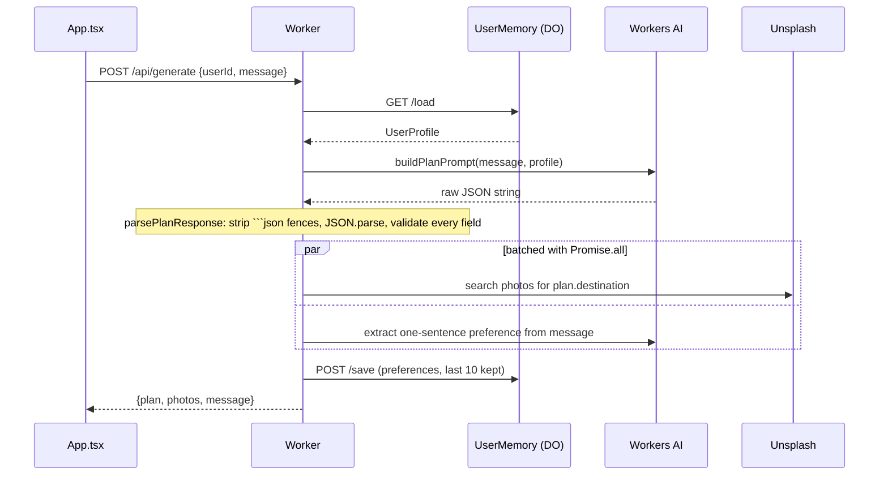

# Architecture

Two independently deployed packages that share only an HTTP contract and a hand-duplicated set of
TypeScript types. There is no monorepo tooling, no shared package, and no root `package.json`.

```
frontend/  React 19 SPA  ──HTTP/JSON──▶  worker/  Cloudflare Worker
(Cloudflare Pages)                       (Workers AI + Durable Objects + Unsplash)
```

## Components

### Worker (`worker/src`)

`index.ts` is the whole router — a single `fetch` handler with literal pathname comparisons.

| Route | Purpose |
| --- | --- |
| `GET /` | Health check, plain text |
| `POST /api/generate` | `{userId, message}` → `{plan, photos, message}`. The main path. |
| `POST /api/replace-highlight` | `{destination, day, currentTitle, allHighlights}` → `{highlight}` |
| `GET /api/profile/:userId` | `{profile}` from the Durable Object |

`OPTIONS` short-circuits to CORS preflight. Anything else is a 404. Every response is built by
`jsonResponse`/`errorResponse` in `utils/helpers.ts`, which is the only place CORS headers are set.

`workflow.ts` holds the two AI orchestrations:

- **`executeWorkflow(ai, message, userProfile, unsplashKey)`** — the main flow, described below.
- **`replaceHighlight(ai, params)`** — a single-shot call that is given the full existing itinerary
  and told not to repeat any of it. Its prompt is inline rather than in `utils/prompts.ts`
  (inconsistent with `buildPlanPrompt`; worth unifying).

`memory/UserMemory.ts` is the Durable Object. It keeps one key, `"profile"`, holding
`{profile, lastUpdated}`. The DO exposes both direct methods (`load`/`save`/`reset`) and a
`fetch` interface at `/load`, `/save`, `/reset`; the worker only ever uses the `fetch` interface,
via the `getUserProfile`/`updateUserProfile` helpers in the same file. The DO id is derived with
`idFromName(userId)`, so the userId string alone addresses the instance.

### Frontend (`frontend/src`)

State lives entirely in `App.tsx` — a `messages` array, a `loading` flag, the theme, the gallery
toggle, and a `userId` generated once with `crypto.randomUUID()` and persisted in `localStorage`.
There is no state library and no router.

`App.tsx` chooses between `WelcomeScreen` (when only the greeting message exists) and `ChatWindow`.
`ChatWindow` maps messages to `MessageContent` and aggregates every message's photos into the
`PhotoGallery` sidebar. `MessageContent` is the interesting one: it groups highlights by `date`
into a timeline, renders each as an accordion, and owns the "Replace this activity" call — it
fetches `/api/replace-highlight` itself and hands the result back up through a callback so
`App.tsx` can patch the message in place.

## Data flow — `POST /api/generate`



Memory is deliberately weak: the second AI call reduces the message to one sentence like
"Prefers budget-friendly beach vacations", appends it, and keeps the last 10. On the next request
`buildPlanPrompt` injects only the last 3 into the prompt. The other `UserProfile` fields
(`name`, `budget`, `homeCountry`, `travelStyle`, `pastTrips`) are declared in
`memory/schema.ts` but nothing ever writes them.

## Key abstractions

- **`TravelPlan`** — `{destination, destinationOverview, highlights[], optionalAddOns}`, where each
  highlight is `{title, date, description}` and `date` is a label like `"Day 3"`, not a real date.
  Grouping in the UI is string equality on that label, which is why `buildPlanPrompt` insists that
  same-day highlights use the byte-identical string. This type is written out three times —
  `worker/src/utils/plan.ts`, `frontend/src/types.ts`, and prose inside `buildPlanPrompt` — and
  nothing enforces agreement.
- **Defensive parsing** — every AI response goes through the same shape: accept an object if the
  platform already parsed it, otherwise strip markdown fences and `JSON.parse`, then check each
  field's type before returning. Repeated in `parsePlanResponse`, `replaceHighlight`, and
  `extractDestination`. A good candidate for extraction into one helper.
- **Design tokens** — `index.css` defines HSL triples on `:root` and `.dark`, exposed to Tailwind v4
  through `@theme inline`. Components only ever name semantic tokens, so the theme toggle in
  `App.tsx` (which flips a `dark` class on `<html>`) is the single switch.

## External dependencies

| Dependency | Where | Notes |
| --- | --- | --- |
| Workers AI, `@cf/meta/llama-3.3-70b-instruct-fp8-fast` | `AI` binding | 2 calls per `/api/generate` |
| Durable Objects | `USER_MEMORY` binding, `new_sqlite_classes` | one instance per userId |
| Unsplash Search API | `utils/photos.ts` | key currently in `wrangler.toml [vars]` — see the security note in `docs/PROGRESS.md` |
| React 19, Vite 7, Tailwind 4, framer-motion, lucide-react | frontend | Tailwind v4 is CSS-first: no `tailwind.config.js` |

## Design decisions (inferred from code and git history)

- **One JSON call instead of a chain.** The original README describes generating itinerary, schedule
  and packing list "in one call". The current prompt still does one big structured call rather than
  a multi-step agent — cheapest and lowest-latency on Workers AI.
- **`Promise.all` for the photo and memory calls** (commit `5ceade4`, the most recent). These don't
  depend on each other, so they were explicitly parallelized after the fact.
- **Durable Object keyed by a client-generated UUID.** No auth, no accounts. Commit `c1a40e2`
  ("durable objects persists userID") moved the id into `localStorage` so a returning browser keeps
  its memory. The tradeoff is that memory is per-browser and trivially spoofable.
- **Highlights as a flat list with a day label**, grouped client-side, rather than a nested
  `days[]` structure. Keeps the model's output shape flat and easy to validate, and makes
  single-activity replacement a simple find-and-swap.
- **Frontend rewritten twice** (`871193c` "frontend redo", `c13ba57` "ADD: GenUI"). The current
  structured-timeline renderer replaced a markdown-string renderer; the markdown path still survives
  as the fallback branch at the bottom of `MessageContent.tsx` for messages with no `plan`.
